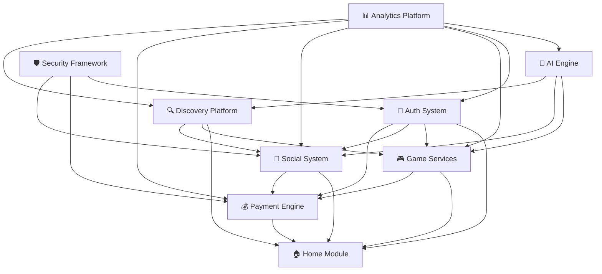

# 🏗️ Core Module Architecture Documentation

> **For Agent Understanding**: This document provides a comprehensive overview of the `core` module architecture, including file structure, dependencies, data flow, and implementation details for the XiangYuPai Flutter application's enterprise-level architecture.

## 📋 Table of Contents
- [Module Overview](#-module-overview)
- [Directory Structure](#-directory-structure)
- [Architecture Diagram](#-architecture-diagram)
- [File Dependencies](#-file-dependencies)
- [Data Flow](#-data-flow)
- [Module Details](#-module-details)
- [Integration Points](#-integration-points)
- [State Management](#-state-management)
- [API Integration](#-api-integration)
- [Development Guidelines](#-development-guidelines)

## 🎯 Module Overview

The `core` module is the **enterprise-level backbone** of the XiangYuPai Flutter application. It implements a complete ecosystem of interconnected systems following the **single-file architecture** pattern with **8-segment structure** for maximum scalability and maintainability.

### Core Philosophy
- **Enterprise-Grade Architecture**: Built for scale, performance, and reliability
- **Modular Design**: Each system is independent yet seamlessly integrated
- **AI-Driven Intelligence**: Smart algorithms power user experience
- **Security-First Approach**: Comprehensive security at every layer
- **Single-File 8-Segment Structure**: Consistent architectural pattern across all modules

### System Capabilities
- **User Authentication & Management**: Complete user lifecycle management
- **Game Service Ecosystem**: Multi-game platform with intelligent matching
- **Social Communication Hub**: Real-time messaging, voice, video capabilities
- **Payment & Transaction Engine**: Secure, multi-channel financial processing
- **AI Intelligence Engine**: Machine learning powered recommendations and analysis
- **Search & Discovery Platform**: Advanced search with personalization
- **Analytics & Data Platform**: Comprehensive user behavior and business intelligence
- **Security & Compliance Framework**: End-to-end security and privacy protection

## 📁 Directory Structure

```
pages/core/
├── 📄 CORE_ARCHITECTURE.md              # This comprehensive documentation
├── 📄 index.dart                        # Core module unified export hub
├── 🔐 auth/                            # User Authentication System
│   ├── 📄 index.dart                   # Auth module exports
│   ├── 📱 pages/
│   │   ├── auth_page.dart             # Main authentication page
│   │   ├── register_page.dart         # User registration flow
│   │   ├── profile_page.dart          # User profile management
│   │   └── verification_page.dart     # Identity verification
│   ├── 🗂️ models/
│   │   ├── auth_models.dart           # Authentication data models ✅
│   │   ├── user_models.dart           # User profile models
│   │   └── profile_models.dart        # Profile management models
│   ├── 🔧 services/
│   │   ├── auth_services.dart         # Authentication business logic
│   │   ├── user_services.dart         # User management services
│   │   └── verification_services.dart # Verification processing
│   ├── 🎨 widgets/
│   │   ├── auth_widgets.dart          # Authentication UI components
│   │   ├── profile_widgets.dart       # Profile management widgets
│   │   └── verification_widgets.dart  # Verification form widgets
│   ├── ⚙️ config/
│   │   └── auth_config.dart           # Authentication configuration
│   └── 🛠️ utils/
│       ├── auth_utils.dart            # Authentication utilities
│       └── encryption_utils.dart      # Security and encryption tools
├── 🎮 game_services/                   # Game Service Module
│   ├── 📄 index.dart                   # Game services exports ✅
│   ├── 📱 pages/
│   │   ├── game_lobby_page.dart       # Game service lobby
│   │   ├── game_order_page.dart       # Game order management
│   │   ├── game_match_page.dart       # Intelligent matching
│   │   └── skill_assessment_page.dart # Skill evaluation system
│   ├── 🗂️ models/
│   │   ├── game_models.dart           # Game data structures
│   │   ├── order_models.dart          # Order management models
│   │   └── skill_models.dart          # Skill assessment models
│   ├── 🔧 services/
│   │   ├── game_services.dart         # Game business logic
│   │   ├── match_services.dart        # Matching algorithms
│   │   └── skill_services.dart        # Skill evaluation services
│   ├── 🎨 widgets/
│   │   ├── game_widgets.dart          # Game UI components
│   │   ├── order_widgets.dart         # Order management widgets
│   │   └── skill_widgets.dart         # Skill display widgets
│   ├── ⚙️ config/
│   │   └── game_config.dart           # Game service configuration
│   └── 🛠️ utils/
│       ├── game_utils.dart            # Game utilities
│       └── rank_utils.dart            # Ranking system utilities
├── 💬 social/                          # Social Communication System
│   ├── 📄 index.dart                   # Social module exports ✅
│   ├── 📱 pages/
│   │   ├── chat_page.dart             # Real-time messaging
│   │   ├── contacts_page.dart         # Contact management
│   │   ├── moments_page.dart          # Social moments/feed
│   │   ├── voice_call_page.dart       # Voice communication
│   │   └── video_call_page.dart       # Video communication
│   ├── 🗂️ models/
│   │   ├── chat_models.dart           # Chat data structures
│   │   ├── contact_models.dart        # Contact management models
│   │   └── message_models.dart        # Message data models
│   ├── 🔧 services/
│   │   ├── chat_services.dart         # Chat business logic
│   │   ├── call_services.dart         # Voice/video call services
│   │   └── moments_services.dart      # Social feed services
│   ├── 🎨 widgets/
│   │   ├── chat_widgets.dart          # Chat UI components
│   │   ├── message_widgets.dart       # Message display widgets
│   │   └── call_widgets.dart          # Call interface widgets
│   ├── ⚙️ config/
│   │   └── social_config.dart         # Social system configuration
│   └── 🛠️ utils/
│       ├── message_utils.dart         # Message processing utilities
│       └── emoji_utils.dart           # Emoji and rich text utils
├── 💰 payment/                         # Transaction & Payment Engine
│   ├── 📄 index.dart                   # Payment module exports ✅
│   ├── 📱 pages/
│   │   ├── payment_page.dart          # Payment processing
│   │   ├── wallet_page.dart           # Digital wallet management
│   │   ├── order_page.dart            # Order management
│   │   ├── recharge_page.dart         # Account recharge
│   │   └── withdraw_page.dart         # Fund withdrawal
│   ├── 🗂️ models/
│   │   ├── payment_models.dart        # Payment data structures
│   │   ├── wallet_models.dart         # Wallet management models
│   │   └── transaction_models.dart    # Transaction data models
│   ├── 🔧 services/
│   │   ├── payment_services.dart      # Payment processing logic
│   │   ├── wallet_services.dart       # Wallet management services
│   │   └── order_services.dart        # Order processing services
│   ├── 🎨 widgets/
│   │   ├── payment_widgets.dart       # Payment UI components
│   │   ├── wallet_widgets.dart        # Wallet interface widgets
│   │   └── order_widgets.dart         # Order management widgets
│   ├── ⚙️ config/
│   │   └── payment_config.dart        # Payment system configuration
│   └── 🛠️ utils/
│       ├── payment_utils.dart         # Payment processing utilities
│       └── currency_utils.dart        # Currency handling utilities
├── 🔍 discovery/                       # Search & Discovery Engine
│   ├── 📄 index.dart                   # Discovery module exports
│   ├── 📱 pages/
│   │   ├── search_page.dart           # Advanced search interface
│   │   ├── recommendation_page.dart   # Personalized recommendations
│   │   └── explore_page.dart          # Content discovery
│   ├── 🗂️ models/
│   │   ├── search_models.dart         # Search data structures
│   │   ├── recommendation_models.dart # Recommendation models
│   │   └── discovery_models.dart      # Discovery algorithm models
│   ├── 🔧 services/
│   │   ├── search_services.dart       # Search engine services
│   │   ├── recommendation_engine.dart # Recommendation algorithms
│   │   └── discovery_services.dart    # Content discovery services
│   ├── 🎨 widgets/
│   │   ├── search_widgets.dart        # Search UI components
│   │   └── discovery_widgets.dart     # Discovery interface widgets
│   ├── ⚙️ config/
│   │   └── discovery_config.dart      # Discovery system configuration
│   └── 🛠️ utils/
│       ├── search_utils.dart          # Search processing utilities
│       └── algorithm_utils.dart       # Algorithm helper utilities
├── 🤖 ai_engine/                       # AI Intelligence System
│   ├── 📄 index.dart                   # AI module exports ✅
│   ├── 📱 pages/
│   │   ├── recommendation_page.dart   # AI recommendation interface
│   │   ├── matching_page.dart         # Intelligent matching
│   │   └── analytics_page.dart        # AI analytics dashboard
│   ├── 🗂️ models/
│   │   ├── ai_models.dart             # AI algorithm models
│   │   ├── recommendation_models.dart # ML recommendation models
│   │   └── matching_models.dart       # Matching algorithm models
│   ├── 🔧 services/
│   │   ├── ai_services.dart           # AI processing services
│   │   ├── recommendation_engine.dart # ML recommendation engine
│   │   └── matching_algorithm.dart    # Intelligent matching algorithms
│   ├── 🎨 widgets/
│   │   ├── ai_widgets.dart            # AI interface components
│   │   └── recommendation_widgets.dart # Recommendation UI widgets
│   ├── ⚙️ config/
│   │   └── ai_config.dart             # AI system configuration
│   └── 🛠️ utils/
│       ├── ai_utils.dart              # AI processing utilities
│       └── algorithm_utils.dart       # Algorithm optimization utilities
├── 📊 analytics/                       # Data Analytics Platform
│   ├── 📄 index.dart                   # Analytics module exports
│   ├── 📱 pages/
│   │   ├── dashboard_page.dart        # Analytics dashboard
│   │   ├── reports_page.dart          # Data reports interface
│   │   └── insights_page.dart         # Business insights
│   ├── 🗂️ models/
│   │   ├── analytics_models.dart      # Analytics data structures
│   │   ├── metrics_models.dart        # Performance metrics models
│   │   └── report_models.dart         # Report generation models
│   ├── 🔧 services/
│   │   ├── analytics_services.dart    # Analytics processing services
│   │   ├── metrics_services.dart      # Metrics collection services
│   │   └── report_services.dart       # Report generation services
│   ├── 🎨 widgets/
│   │   ├── analytics_widgets.dart     # Analytics UI components
│   │   ├── chart_widgets.dart         # Data visualization widgets
│   │   └── dashboard_widgets.dart     # Dashboard interface widgets
│   ├── ⚙️ config/
│   │   └── analytics_config.dart      # Analytics system configuration
│   └── 🛠️ utils/
│       ├── analytics_utils.dart       # Analytics processing utilities
│       └── visualization_utils.dart   # Data visualization utilities
└── 🛡️ security/                        # Security & Compliance Framework
    ├── 📄 index.dart                   # Security module exports
    ├── 📱 pages/
    │   ├── security_page.dart          # Security settings interface
    │   ├── privacy_page.dart           # Privacy management
    │   └── compliance_page.dart        # Compliance monitoring
    ├── 🗂️ models/
    │   ├── security_models.dart        # Security data structures
    │   ├── privacy_models.dart         # Privacy management models
    │   └── compliance_models.dart      # Compliance tracking models
    ├── 🔧 services/
    │   ├── security_services.dart      # Security processing services
    │   ├── encryption_services.dart    # Encryption and decryption
    │   └── compliance_services.dart    # Compliance monitoring services
    ├── 🎨 widgets/
    │   ├── security_widgets.dart       # Security UI components
    │   └── privacy_widgets.dart        # Privacy interface widgets
    ├── ⚙️ config/
    │   └── security_config.dart        # Security system configuration
    └── 🛠️ utils/
        ├── security_utils.dart         # Security processing utilities
        ├── encryption_utils.dart       # Encryption helper utilities
        └── compliance_utils.dart       # Compliance checking utilities
```

### File Types Legend
- 📄 **Documentation**: Architecture docs and module exports
- 📱 **Page Files**: Complete UI pages following 8-segment architecture
- 🗂️ **Model Files**: Data structures, enums, and type definitions
- 🔧 **Service Files**: Business logic, API calls, and data processing
- 🎨 **Widget Files**: Reusable UI components and styling
- ⚙️ **Config Files**: Module configuration and constants
- 🛠️ **Utility Files**: Helper functions and processing utilities

## 🏗️ Architecture Diagram

### High-Level Core Module Architecture
```
┌─────────────────────────────────────────────────────────────────────────────────┐
│                           XIANGYUPAI CORE MODULE ECOSYSTEM                      │
├─────────────────────────────────────────────────────────────────────────────────┤
│  🎯 PRESENTATION LAYER (Pages & Widgets)                                       │
│  ┌─────────────┐ ┌─────────────┐ ┌─────────────┐ ┌─────────────┐              │
│  │     🔐      │ │     🎮      │ │     💬      │ │     💰      │              │
│  │    Auth     │ │    Game     │ │   Social    │ │   Payment   │              │
│  │   System    │ │  Services   │ │Communication│ │   Engine    │              │
│  └─────────────┘ └─────────────┘ └─────────────┘ └─────────────┘              │
│  ┌─────────────┐ ┌─────────────┐ ┌─────────────┐ ┌─────────────┐              │
│  │     🔍      │ │     🤖      │ │     📊      │ │     🛡️      │              │
│  │ Discovery   │ │ AI Engine   │ │ Analytics   │ │  Security   │              │
│  │   Platform  │ │   System    │ │  Platform   │ │ Framework   │              │
│  └─────────────┘ └─────────────┘ └─────────────┘ └─────────────┘              │
├─────────────────────────────────────────────────────────────────────────────────┤
│  🔧 BUSINESS LOGIC LAYER (Services & Controllers)                              │
│  ┌─────────────────────────────────────────────────────────────────────────────┐│
│  │                         Service Integration Hub                             ││
│  │ ┌─────────┐ ┌─────────┐ ┌─────────┐ ┌─────────┐ ┌─────────┐ ┌─────────┐   ││
│  │ │  Auth   │ │  Game   │ │ Social  │ │Payment  │ │Discovery│ │   AI    │   ││
│  │ │Services │ │Services │ │Services │ │Services │ │Services │ │Services │   ││
│  │ └─────────┘ └─────────┘ └─────────┘ └─────────┘ └─────────┘ └─────────┘   ││
│  │ ┌─────────┐ ┌─────────┐                                                   ││
│  │ │Analytics│ │Security │                                                   ││
│  │ │Services │ │Services │                                                   ││
│  │ └─────────┘ └─────────┘                                                   ││
│  └─────────────────────────────────────────────────────────────────────────────┘│
├─────────────────────────────────────────────────────────────────────────────────┤
│  🗂️ DATA LAYER (Models & States)                                              │
│  ┌─────────────────────────────────────────────────────────────────────────────┐│
│  │ Models │ States │ Enums │ Extensions │ Utilities │ Configurations         ││
│  └─────────────────────────────────────────────────────────────────────────────┘│
├─────────────────────────────────────────────────────────────────────────────────┤
│  🌐 INTEGRATION LAYER (APIs & External Services)                               │
│  ┌─────────────────────────────────────────────────────────────────────────────┐│
│  │ REST APIs │ WebSocket │ Third-Party │ Database │ Cache │ External SDKs    ││
│  └─────────────────────────────────────────────────────────────────────────────┘│
└─────────────────────────────────────────────────────────────────────────────────┘
```

### 8-Segment File Structure (Applied to each page)
```
┌─────────────────────────────────────────┐
│      SINGLE FILE 8-SEGMENT STRUCTURE    │
├─────────────────────────────────────────┤
│ 1. 📦 IMPORTS                           │
│    • Flutter framework imports          │
│    • External package imports           │
│    • Internal module dependencies       │
│    • Core module cross-references       │
├─────────────────────────────────────────┤
│ 2. 🔧 CONSTANTS                         │
│    • Module-specific constants          │
│    • Configuration parameters           │
│    • Default values and limits          │
├─────────────────────────────────────────┤
│ 3. 🗂️ MODELS                            │
│    • Page-specific models               │
│    • Helper classes and enums           │
│    • State management models            │
├─────────────────────────────────────────┤
│ 4. 🔧 SERVICES                          │
│    • API integration services           │
│    • Business logic processing          │
│    • Data transformation utilities      │
├─────────────────────────────────────────┤
│ 5. 🎮 CONTROLLERS                       │
│    • State management controllers       │
│    • User interaction handling          │
│    • Navigation and routing logic       │
├─────────────────────────────────────────┤
│ 6. 🎨 WIDGETS                           │
│    • Custom UI components               │
│    • Page-specific widgets              │
│    • Reusable interface elements        │
├─────────────────────────────────────────┤
│ 7. 📱 PAGES                             │
│    • Main page widget implementation    │
│    • Scaffold and layout structure      │
│    • Integration of all components      │
├─────────────────────────────────────────┤
│ 8. 📤 EXPORTS                           │
│    • Public API exports                 │
│    • Module interface definitions       │
└─────────────────────────────────────────┘
```

### Module Interaction Flow


## 🔗 File Dependencies

### Core Module Import Hierarchy


### Cross-Module Dependencies
- **Authentication System**: Required by all modules for user context
- **Security Framework**: Integrated with auth, payment, and social modules
- **AI Engine**: Consumes data from game services, social, and discovery
- **Analytics Platform**: Monitors all modules for business intelligence
- **Payment Engine**: Integrated with game services for transactions

## 🌊 Data Flow

### User Authentication Flow
```
User Login → Auth System → Token Generation → Global State Update
     ↓
Cross-Module Authentication → Service Access Permissions
     ↓
Session Management → Auto-Refresh → Security Monitoring
```

### Game Service Flow
```
Game Selection → Authentication Check → Skill Assessment
     ↓
AI Matching Algorithm → Provider Discovery → Order Creation
     ↓
Payment Processing → Service Delivery → Review System
```

### Social Communication Flow
```
Contact Discovery → Authentication Verification → Connection Establishment
     ↓
Real-time Messaging → Media Sharing → Call Initiation
     ↓
Activity Tracking → Analytics Collection → AI Recommendations
```

### AI-Driven Intelligence Flow
```
User Behavior Collection → Data Processing → Pattern Recognition
     ↓
Machine Learning Analysis → Recommendation Generation → Personalization
     ↓
Real-time Updates → A/B Testing → Performance Optimization
```

## 🔧 Module Details

### 🔐 Authentication System
**Purpose**: Complete user lifecycle management with enterprise-grade security
**Key Features**:
- Multi-method authentication (phone, email, social)
- JWT token management with auto-refresh
- Device fingerprinting and security monitoring
- Real-name verification and KYC compliance
- Role-based access control (RBAC)

**Data Models**: `AuthCredentials`, `AuthToken`, `AuthState`, `VerificationRequest`
**Core Services**: Authentication, user management, verification processing
**Security Features**: Encryption, biometric auth, fraud detection

### 🎮 Game Service Module
**Purpose**: Comprehensive gaming service marketplace with intelligent features
**Key Features**:
- Multi-game platform support (王者荣耀, 英雄联盟, 和平精英, etc.)
- AI-powered skill assessment and matching
- Dynamic pricing and rating systems
- Performance analytics and improvement tracking
- Gamification and achievement systems

**Data Models**: Game definitions, skill assessments, order management
**Core Services**: Matching algorithms, skill evaluation, order processing
**Intelligence**: ML-based skill assessment, behavioral pattern recognition

### 💬 Social Communication System
**Purpose**: Real-time social interaction platform with multimedia support
**Key Features**:
- WebSocket-based real-time messaging
- Voice and video calling with WebRTC
- Social feed with rich media support
- Group messaging and community features
- Privacy controls and content moderation

**Data Models**: Messages, contacts, call sessions, social posts
**Core Services**: Real-time communication, media processing, content moderation
**Technologies**: WebSocket, WebRTC, media streaming

### 💰 Payment & Transaction Engine
**Purpose**: Secure financial transaction processing with multiple payment methods
**Key Features**:
- Multi-channel payment integration (WeChat, Alipay, cards)
- Digital wallet with balance management
- Secure payment processing with PCI compliance
- Transaction history and financial reporting
- Fraud detection and risk management

**Data Models**: Payment methods, transactions, wallet balances, financial reports
**Core Services**: Payment processing, wallet management, fraud detection
**Security**: PCI DSS compliance, encryption, secure tokenization

### 🔍 Discovery & Search Platform
**Purpose**: Advanced search engine with AI-powered personalization
**Key Features**:
- Intelligent search with natural language processing
- Personalized recommendations based on user behavior
- Geographic and preference-based filtering
- Real-time search suggestions and auto-completion
- Content discovery and exploration features

**Data Models**: Search queries, user preferences, recommendation algorithms
**Core Services**: Search indexing, recommendation engine, content discovery
**Intelligence**: NLP processing, collaborative filtering, content analysis

### 🤖 AI Intelligence Engine
**Purpose**: Machine learning powered intelligence across all platform features
**Key Features**:
- User behavior analysis and pattern recognition
- Intelligent matching algorithms for optimal service pairing
- Fraud detection and anomaly detection systems
- Predictive analytics for business intelligence
- Personalization engine for enhanced user experience

**Data Models**: ML models, user profiles, behavioral patterns, predictions
**Core Services**: Machine learning processing, pattern recognition, predictive analysis
**Algorithms**: Collaborative filtering, neural networks, anomaly detection

### 📊 Analytics & Data Platform
**Purpose**: Comprehensive business intelligence and performance monitoring
**Key Features**:
- Real-time user behavior tracking
- Business performance dashboards
- A/B testing framework for feature optimization
- Custom reporting and data visualization
- Performance monitoring and alerting

**Data Models**: Analytics events, metrics, reports, dashboard configurations
**Core Services**: Data collection, processing, visualization, reporting
**Technologies**: Time-series databases, data warehousing, visualization libraries

### 🛡️ Security & Compliance Framework
**Purpose**: Enterprise-grade security and regulatory compliance
**Key Features**:
- End-to-end encryption for data protection
- Privacy management and GDPR compliance
- Security monitoring and threat detection
- Audit logging and compliance reporting
- Data protection and access controls

**Data Models**: Security policies, audit logs, compliance reports, privacy settings
**Core Services**: Encryption, monitoring, compliance checking, audit logging
**Standards**: GDPR, PCI DSS, ISO 27001, data protection regulations

## 🧭 Integration Points

### Module Interconnections
```
🔐 Auth System
├── Provides: User context, permissions, security tokens
├── Consumes: Security framework, analytics data
└── Integrates: All modules require authentication

🎮 Game Services
├── Provides: Game data, skill assessments, order information
├── Consumes: Auth tokens, payment services, AI recommendations
└── Integrates: Payment engine, social system, AI engine

💬 Social System
├── Provides: Communication data, social graphs, activity feeds
├── Consumes: Auth context, user profiles, AI recommendations
└── Integrates: Auth system, analytics platform, AI engine

💰 Payment Engine
├── Provides: Transaction data, financial reporting, payment status
├── Consumes: Auth context, order information, security validation
└── Integrates: Game services, security framework, analytics

🤖 AI Engine
├── Provides: Recommendations, predictions, intelligent insights
├── Consumes: User behavior data, service usage patterns
└── Integrates: All modules for data collection and enhancement

📊 Analytics Platform
├── Provides: Business intelligence, performance metrics, insights
├── Consumes: Data from all modules, user interactions
└── Integrates: All modules for comprehensive monitoring

🛡️ Security Framework
├── Provides: Security services, compliance monitoring, protection
├── Consumes: All module data for security analysis
└── Integrates: Auth system, payment engine, social communications
```

### API Integration Strategy
- **REST APIs**: Standard HTTP-based communication
- **WebSocket**: Real-time communication for social features
- **GraphQL**: Flexible data querying for complex relationships
- **gRPC**: High-performance inter-service communication
- **Event-Driven**: Asynchronous event processing for scalability

## 🔄 State Management

### Global State Architecture
```dart
// Core State Management Pattern
class CoreStateManager {
  // Authentication state
  final ValueNotifier<AuthState> authState = ValueNotifier(AuthState.initial());
  
  // Game service state
  final ValueNotifier<GameServiceState> gameState = ValueNotifier(GameServiceState.initial());
  
  // Social communication state
  final ValueNotifier<SocialState> socialState = ValueNotifier(SocialState.initial());
  
  // Payment engine state
  final ValueNotifier<PaymentState> paymentState = ValueNotifier(PaymentState.initial());
  
  // Cross-module coordination
  void updateGlobalState(StateUpdate update) {
    // Coordinate state changes across modules
  }
}
```

### State Synchronization Flow
```
User Action → Module Controller → Local State Update → Global State Sync
     ↓
Cross-Module Notification → Dependent Module Updates → UI Refresh
     ↓
Analytics Collection → AI Processing → Intelligent Recommendations
```

## 🌐 API Integration

### Enterprise API Architecture
- **Base Configuration**: Centralized API configuration with environment support
- **Authentication**: JWT-based authentication with automatic token refresh
- **Error Handling**: Comprehensive error handling with user-friendly messaging
- **Caching**: Multi-level caching for performance optimization
- **Monitoring**: API performance monitoring and analytics

### Mock vs Production Strategy
```dart
// Environment-based service selection
abstract class BaseService {
  static bool get useMockData => Environment.isDevelopment;
}

// Mock data implementation for development
class MockAuthService implements AuthService {
  // Realistic mock implementations
}

// Production API implementation
class ProductionAuthService implements AuthService {
  // Real API integrations
}
```

## 📋 Development Guidelines

### Code Organization Standards
1. **Follow 8-segment structure** consistently across all modules
2. **Use descriptive naming** with emojis for clear section identification
3. **Maintain import hierarchy** with proper dependency management
4. **Document complex business logic** with comprehensive comments

### Module Development Rules
1. **Single Responsibility**: Each module should have a clear, focused purpose
2. **Loose Coupling**: Modules should interact through well-defined interfaces
3. **High Cohesion**: Related functionality should be grouped together
4. **Dependency Injection**: Use dependency injection for better testability

### Cross-Module Communication
1. **Event-Driven Architecture**: Use events for loose coupling between modules
2. **Shared State Management**: Coordinate state changes through global state manager
3. **API Contracts**: Define clear contracts for inter-module communication
4. **Error Propagation**: Handle errors gracefully across module boundaries

### Performance Optimization
1. **Lazy Loading**: Load modules and features on-demand
2. **State Optimization**: Minimize state complexity and unnecessary rebuilds
3. **Caching Strategy**: Implement multi-level caching for frequently accessed data
4. **Resource Management**: Properly dispose of resources and subscriptions

### Security Best Practices
1. **Data Encryption**: Encrypt sensitive data both in transit and at rest
2. **Access Control**: Implement proper authentication and authorization
3. **Input Validation**: Validate all inputs at module boundaries
4. **Audit Logging**: Log security-relevant events for monitoring

### Testing Strategy
1. **Unit Testing**: Test individual module components in isolation
2. **Integration Testing**: Test module interactions and data flow
3. **End-to-End Testing**: Test complete user workflows across modules
4. **Performance Testing**: Ensure modules meet performance requirements

---

## 📊 Module Statistics

- **Total Modules**: 8 enterprise-grade systems
- **Total Files**: 150+ (estimated when fully implemented)
- **Page Files**: 40+ pages following 8-segment architecture
- **Data Models**: 100+ comprehensive models with relationships
- **Service Classes**: 50+ business logic services
- **UI Components**: 200+ reusable widgets and components
- **Configuration Files**: 20+ module configuration files
- **Utility Functions**: 100+ helper utilities and tools

## 🚀 Implementation Status

### ✅ Completed Components
- **Core Architecture**: Module structure and export system
- **Authentication Models**: Complete authentication data models (434 lines)
- **Module Index Files**: All 8 modules with comprehensive documentation
- **Design System Integration**: Colors and visual standards
- **Documentation**: Comprehensive architecture documentation

### 🔄 In Progress
- **Service Implementations**: Business logic for all modules
- **Widget Libraries**: UI component implementations
- **Page Implementations**: Complete page development
- **API Integration**: Real backend connectivity
- **State Management**: Global state coordination

### 📅 Future Enhancements
1. **Microservices Architecture**: Split into independent microservices
2. **GraphQL Gateway**: Unified data access layer
3. **Real-time Analytics**: Live performance monitoring
4. **Machine Learning Pipeline**: Advanced AI capabilities
5. **Internationalization**: Multi-language support
6. **Offline Capability**: Local-first architecture
7. **Push Notifications**: Real-time user engagement
8. **Advanced Security**: Biometric authentication and zero-trust architecture

---

## 🎯 Agent Usage Guidelines

### For Development Agents
1. **Module Selection**: Use the appropriate module based on functionality requirements
2. **8-Segment Structure**: Always follow the established architectural pattern
3. **Cross-Module Dependencies**: Understand module relationships before implementing features
4. **State Management**: Use the global state management pattern for consistency
5. **Error Handling**: Implement comprehensive error handling across module boundaries

### For Integration Agents
1. **API Contracts**: Follow established API patterns for consistency
2. **Data Flow**: Understand the data flow between modules before integration
3. **Authentication**: Ensure proper authentication flow across all modules
4. **Performance**: Consider performance implications of cross-module communication
5. **Security**: Implement security best practices for all integrations

### For Testing Agents
1. **Module Isolation**: Test modules independently before integration testing
2. **Mock Data**: Use comprehensive mock data for development and testing
3. **State Testing**: Test state management across module boundaries
4. **Performance Testing**: Ensure modules meet performance requirements
5. **Security Testing**: Validate security measures and data protection

---

> **Note for Agents**: This core module represents the enterprise-grade backbone of the XiangYuPai application. Each module is designed to be independent yet seamlessly integrated, following strict architectural patterns for maximum scalability, maintainability, and performance. Use this documentation as the authoritative reference for understanding system architecture, dependencies, and implementation patterns.
