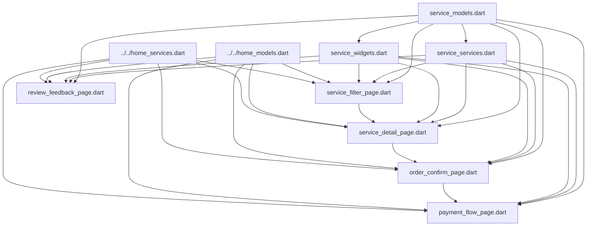

# 🏗️ Service System Module Architecture Documentation

> **For Agent Understanding**: This document provides a comprehensive overview of the `service_system` module architecture, including file structure, dependencies, data flow, and implementation details.

## 📋 Table of Contents
- [Module Overview](#-module-overview)
- [Directory Structure](#-directory-structure)
- [Architecture Diagram](#-architecture-diagram)
- [File Dependencies](#-file-dependencies)
- [Data Flow](#-data-flow)
- [Component Details](#-component-details)
- [Navigation Flow](#-navigation-flow)
- [State Management](#-state-management)
- [API Integration](#-api-integration)
- [Development Guidelines](#-development-guidelines)

## 🎯 Module Overview

The `service_system` module is a comprehensive Flutter module that implements a complete service marketplace system. It follows the **single-file architecture** pattern with **8-segment structure** for each page file.

### Core Features
- **Service Discovery**: Filter and search service providers
- **Service Details**: View provider information and reviews
- **Order Management**: Confirm orders and manage details
- **Payment Processing**: Complete payment flow with multiple methods
- **Review System**: Submit and view service reviews

### Architecture Principles
- **Single Responsibility**: Each file has a clear, focused purpose
- **Reusability**: Generic components work across different service types
- **Scalability**: Easy to extend with new service types
- **Maintainability**: Clean separation of concerns

## 📁 Directory Structure

```
pages/home/submodules/service_system/
├── 📄 SERVICE_SYSTEM_ARCHITECTURE.md     # This documentation file
├── 📱 service_filter_page.dart           # Service filtering & listing page
├── 📱 service_detail_page.dart           # Service provider detail page
├── 📱 order_confirm_page.dart            # Order confirmation page
├── 📱 payment_flow_page.dart             # Payment processing page
├── 📱 review_feedback_page.dart          # Review submission page
├── 🗂️ service_models.dart                # Data models & enums
├── 🔧 service_services.dart              # Business logic & API services
└── 🎨 service_widgets.dart               # Reusable UI components
```

### File Types Legend
- 📱 **Page Files**: Complete UI pages following 8-segment architecture
- 🗂️ **Model Files**: Data structures, enums, and type definitions
- 🔧 **Service Files**: Business logic, API calls, and data processing
- 🎨 **Widget Files**: Reusable UI components and styling

## 🏗️ Architecture Diagram

### High-Level Module Architecture
```
┌─────────────────────────────────────────────────────────────┐
│                    SERVICE SYSTEM MODULE                    │
├─────────────────────────────────────────────────────────────┤
│  📱 PRESENTATION LAYER (Pages)                             │
│  ┌─────────────┐ ┌─────────────┐ ┌─────────────┐          │
│  │   Filter    │ │   Detail    │ │   Order     │          │
│  │    Page     │ │    Page     │ │  Confirm    │          │
│  └─────────────┘ └─────────────┘ └─────────────┘          │
│  ┌─────────────┐ ┌─────────────┐                          │
│  │   Payment   │ │   Review    │                          │
│  │    Flow     │ │  Feedback   │                          │
│  └─────────────┘ └─────────────┘                          │
├─────────────────────────────────────────────────────────────┤
│  🎨 UI COMPONENT LAYER (Widgets)                           │
│  ┌─────────────────────────────────────────────────────────┐│
│  │ ServiceCard │ ServiceAvatar │ ServiceRating │ ...      ││
│  └─────────────────────────────────────────────────────────┘│
├─────────────────────────────────────────────────────────────┤
│  🔧 BUSINESS LOGIC LAYER (Services)                        │
│  ┌─────────────────────────────────────────────────────────┐│
│  │         ServiceSystemService (Singleton)               ││
│  │  ┌─────────┐ ┌─────────┐ ┌─────────┐ ┌─────────┐      ││
│  │  │Provider │ │ Order   │ │Payment  │ │ Review  │      ││
│  │  │Services │ │Services │ │Services │ │Services │      ││
│  │  └─────────┘ └─────────┘ └─────────┘ └─────────┘      ││
│  └─────────────────────────────────────────────────────────┘│
├─────────────────────────────────────────────────────────────┤
│  🗂️ DATA LAYER (Models)                                   │
│  ┌─────────────────────────────────────────────────────────┐│
│  │ Enums │ Models │ States │ Extensions │ Utilities       ││
│  └─────────────────────────────────────────────────────────┘│
└─────────────────────────────────────────────────────────────┘
```

### 8-Segment File Structure (Applied to each page)
```
┌─────────────────────────────────────────┐
│           SINGLE FILE STRUCTURE          │
├─────────────────────────────────────────┤
│ 1. 📦 IMPORTS                           │
│    • Flutter framework                  │
│    • External packages                  │
│    • Internal dependencies              │
├─────────────────────────────────────────┤
│ 2. 🔧 CONSTANTS                         │
│    • UI constants                       │
│    • Business logic constants           │
├─────────────────────────────────────────┤
│ 3. 🗂️ MODELS                            │
│    • Page-specific models               │
│    • Helper classes                     │
├─────────────────────────────────────────┤
│ 4. 🔧 SERVICES                          │
│    • API calls                          │
│    • Data processing                    │
├─────────────────────────────────────────┤
│ 5. 🎮 CONTROLLERS                       │
│    • State management                   │
│    • Business logic                     │
├─────────────────────────────────────────┤
│ 6. 🎨 WIDGETS                           │
│    • Custom UI components               │
│    • Page-specific widgets              │
├─────────────────────────────────────────┤
│ 7. 📱 PAGES                             │
│    • Main page widget                   │
│    • Scaffold structure                 │
├─────────────────────────────────────────┤
│ 8. 📤 EXPORTS                           │
│    • Public API exports                 │
└─────────────────────────────────────────┘
```

## 🔗 File Dependencies

### Import Dependency Graph


### External Dependencies
- **Flutter Framework**: `material.dart`, `services.dart`
- **Dart Core**: `async.dart`, `developer.dart`
- **Parent Modules**: `home_models.dart`, `home_services.dart`

## 🌊 Data Flow

### Service Discovery Flow
```
User Input → ServiceFilterPage → ServiceSystemService → Mock Data → UI Update
     ↓
Filter/Sort Options → State Update → Provider List Refresh
     ↓
Provider Selection → Navigate to ServiceDetailPage
```

### Order Processing Flow
```
Service Selection → ServiceDetailPage → Order Button
     ↓
OrderConfirmPage → Quantity/Notes → Confirm Order
     ↓
PaymentFlowPage → Payment Method → Process Payment
     ↓
Success/Failure → Navigate Back → Optional Review
```

### State Management Flow
```
User Action → Controller Method → State Update → UI Rebuild
     ↓
ValueNotifier → ValueListenableBuilder → Widget Tree Update
```

## 🔧 Component Details

### 📱 Page Components

#### 1. ServiceFilterPage
- **Purpose**: Service discovery and filtering
- **Key Features**: Search, filter, sort, infinite scroll
- **Navigation**: → ServiceDetailPage
- **State**: ServicePageState
- **Controller**: _ServiceFilterController

#### 2. ServiceDetailPage
- **Purpose**: Service provider details and reviews
- **Key Features**: Provider info, reviews, booking
- **Navigation**: → OrderConfirmPage
- **State**: ServiceDetailPageState
- **Controller**: _ServiceDetailController

#### 3. OrderConfirmPage
- **Purpose**: Order confirmation and customization
- **Key Features**: Quantity selection, notes, pricing
- **Navigation**: → PaymentFlowPage
- **State**: OrderConfirmPageState
- **Controller**: _OrderConfirmController

#### 4. PaymentFlowPage
- **Purpose**: Payment processing workflow
- **Key Features**: Method selection, password, processing
- **Navigation**: ← Back to home (popUntil)
- **State**: PaymentFlowPageState
- **Controller**: _PaymentFlowController

#### 5. ReviewFeedbackPage
- **Purpose**: Service review and rating
- **Key Features**: Rating, tags, content input
- **Navigation**: ← Back to previous page
- **State**: ReviewFeedbackPageState
- **Controller**: _ReviewFeedbackController

### 🗂️ Data Models

#### Core Enums
- **ServiceType**: game, entertainment, lifestyle, work
- **GameType**: lol, pubg, brawlStars, honorOfKings
- **OrderStatus**: pending, confirmed, paid, inProgress, completed, cancelled
- **PaymentMethod**: coin, wechat, alipay, apple
- **PaymentStatus**: pending, processing, success, failed, cancelled

#### Primary Models
- **ServiceProviderModel**: Provider information and capabilities
- **ServiceFilterModel**: Search and filter criteria
- **ServiceOrderModel**: Order details and status
- **PaymentInfoModel**: Payment processing information
- **ServiceReviewModel**: Review and rating data

#### State Models
- **ServicePageState**: Filter page state management
- **ServiceDetailPageState**: Detail page state management
- **OrderConfirmPageState**: Order confirmation state
- **PaymentFlowPageState**: Payment flow state with steps
- **ReviewFeedbackPageState**: Review submission state

### 🔧 Service Layer

#### ServiceSystemService (Singleton)
- **Provider Management**: getServiceProviders, getServiceProviderDetail, searchServiceProviders
- **Order Management**: createOrder, getOrderDetail, cancelOrder
- **Payment Processing**: getUserBalance, verifyPaymentPassword, processPayment
- **Review System**: getReviews, submitReview, hasReviewed
- **Caching System**: In-memory cache with expiration timers
- **Mock Data**: Comprehensive mock data generation for development

### 🎨 Widget Library

#### Basic Components
- **ServiceCard**: Container with consistent styling
- **ServiceAvatar**: User profile images with fallbacks
- **ServiceTag**: Categorization and status tags
- **ServiceRating**: Star rating display and input
- **ServicePrice**: Price formatting and display
- **ServiceButton**: Consistent button styling

#### Composite Components
- **ServiceProviderCard**: Complete provider information card
- **ServiceReviewCard**: Review display with rating and content
- **ServiceEmptyState**: Empty state with illustrations
- **ServiceSearchBar**: Search input with styling
- **ServiceTagSelector**: Multi-select tag interface

## 🧭 Navigation Flow

### Primary Navigation Path
```
HomePage → ServiceFilterPage → ServiceDetailPage → OrderConfirmPage → PaymentFlowPage
                                        ↓
                              ReviewFeedbackPage (Optional)
```

### Navigation Implementation
- **Push Navigation**: Standard page transitions
- **Pop Navigation**: Back button handling
- **PopUntil**: Return to home after payment completion
- **Conditional Navigation**: Based on order status and user actions

### Route Parameters
- **ServiceType & ServiceName**: Passed to filter page
- **ProviderId**: Passed to detail page
- **OrderData**: Passed through order flow
- **PaymentInfo**: Passed to payment processing

## 🔄 State Management

### Pattern: ValueNotifier + ValueListenableBuilder
```dart
// Controller Pattern
class _PageController {
  final ValueNotifier<PageState> _state = ValueNotifier(PageState.initial());
  ValueListenable<PageState> get state => _state;
  
  void updateState(PageState newState) {
    _state.value = newState;
  }
}

// UI Usage
ValueListenableBuilder<PageState>(
  valueListenable: controller.state,
  builder: (context, state, child) {
    return Widget(); // Rebuild on state change
  },
)
```

### State Types
- **Loading States**: isLoading, isRefreshing, isLoadingMore
- **Data States**: items, selectedItems, currentPage
- **Error States**: error, hasError
- **UI States**: showAdvancedFilter, selectedTab

## 🌐 API Integration

### Mock API Implementation
- **Realistic Data**: Generated mock data with proper relationships
- **Async Simulation**: Future.delayed for network simulation
- **Error Handling**: Simulated network and business logic errors
- **Pagination**: Proper pagination support
- **Caching**: In-memory caching with expiration

### Future API Integration Points
- **Base URLs**: Configurable API endpoints
- **Authentication**: Token-based auth headers
- **Error Handling**: Standardized error response handling
- **Interceptors**: Logging, auth, and retry logic

## 📋 Development Guidelines

### Code Organization
1. **Follow 8-segment structure** for all page files
2. **Use descriptive naming** with emojis for sections
3. **Maintain consistent imports** order and grouping
4. **Document complex logic** with inline comments

### State Management Rules
1. **One controller per page** for state management
2. **Use ValueNotifier** for reactive state updates
3. **Minimize state complexity** with focused state models
4. **Handle loading and error states** consistently

### UI Development Standards
1. **Reuse components** from service_widgets.dart
2. **Follow Material Design** principles
3. **Implement proper accessibility** features
4. **Test on different screen sizes**

### Performance Considerations
1. **Use ListView.builder** for large lists
2. **Implement pagination** for data loading
3. **Cache frequently accessed data**
4. **Dispose controllers** properly

### Testing Strategy
1. **Unit tests** for business logic
2. **Widget tests** for UI components
3. **Integration tests** for user flows
4. **Mock data validation** for edge cases

---

## 📊 Module Statistics

- **Total Files**: 8
- **Page Files**: 5 (following 8-segment architecture)
- **Support Files**: 3 (models, services, widgets)
- **Lines of Code**: ~4,000+ (estimated)
- **UI Components**: 15+ reusable widgets
- **Data Models**: 10+ core models with enums
- **Business Methods**: 20+ service methods

## 🚀 Future Enhancements

1. **Real API Integration**: Replace mock services with actual API calls
2. **Advanced Filtering**: More sophisticated filter options
3. **Real-time Updates**: WebSocket integration for live updates
4. **Offline Support**: Local database caching
5. **Push Notifications**: Order status updates
6. **Analytics Integration**: User behavior tracking
7. **A/B Testing**: Feature flag support
8. **Internationalization**: Multi-language support

---

> **Note for Agents**: This documentation provides a complete overview of the service_system module. Use this as a reference for understanding the codebase structure, dependencies, and implementation patterns. All code follows Flutter best practices and the established single-file architecture pattern.
